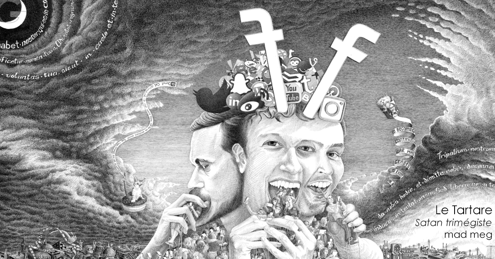
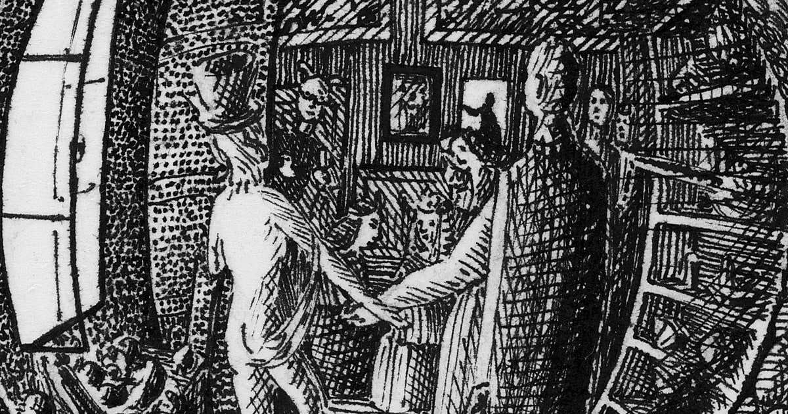

Web apps for [madmeg](http://madmeg.org/).

# L’Athénée des Femmes

## Olympe &amp; Angela (2013-2014)

## Jac sm Kee (2015)

## Simone de Beauvoir (2016)

## Christine de Pizan (2014)

## Angela Davis (2014) *

## Olympe de Gouges (2013) *

# Chambre

## La Clé de ma Chambre (2015)

## Va DATA Chambre (2015)

## Fukushima dans ma Tête (2015)

## La Chambre du Roy (2015)

# Charognes

## Une Charogne à Fezouata (2016)

## Le Phoque Mort (2014)

# Le Tartare

## Zuckerberk (2017)

# Digestions

## Le Jardin des délices (2004-2011-2012)

## Feast of fools (2008-2010)

## La leçon de pornographie (2010)

## Lippido (2006)

## Mad Meg by madmeg (2005)

## Qu’est-ce qui peut bien rendre nos intérieurs… (2005)

## Les Trois Garces (2010) *

# Panoramas

## Lisboa (2009) *

## Shanghai (2010) *

# Les Patriarches

## Patriarche n° 1 (2017)

## Patriarche n° 2 (2016)

## Patriarche n° 3 (2017)

## Patriarche n° 4 (2013)

## Patriarche n° 5 (2017)

## Patriarche n° 6 (2018)

## Patriarche n° 7 (2018)

## Patriarche n° 15 (2018)

## Patriarche n° 22 (2018)

## Patriarche n° 37 (2018)

## Patriarche 40 (2016)

## Patriarche 63498 (2013)

## Patriarche 14 (2005) *

## Patriarche 17 (2016)

## Patriarche 24 - Le pêcheur (2017)

## Patriarche 31 (2006) *

## Patriarche 32 (2006) *

## Patriarche 178 - Le Soldat (2017)

## Patriarche 216 (2016)

# Sorts

## Minus Vis I - Debilitatem (2016)

## Minus Vis II - Aufer Dolor Meus (2017)

## Minus Vis III - Claudere Ora Vesta. ET Aperuit Mea (2017)

## Minus Vis IV - Tarot et complementarum (2018)

## Minus Vis V - Codex Gonadus (2018)

## Minus Vis VI - Rabenvatersschandzauberkapuze (2018)

## Minus Vis VII - Utérus, que tes trompes gonflent d’orgueil (2019)

## Magis habent virtutem I (2016)

## Magis habent virtutem II (2016)

## Magis habent virtutem III (2017)

## Magis habent virtutem IV (2017)

## Magis habent virtutem V (2017)

## Magis habent virtutem VI (2017)

## Magis habent virtutem VII - Rabenmutterfestzauberlied (2018)

## Magis habent virtutem VIII - Ut se cogite qui in villam (2018)

## Magis habent virtutem IX - Lumina Elementa Exordii Mulieribus (2018)

## Magis habent virtutem X - Vade Retro Defecatores (2018)

## Magis habent virtutem XI - Les 10 tremblements pour faire tomber le Mont Sexisme (2019)

## Magis habent virtutem XII - Mortis Rosis (2019)

# Tartares

## Le sabbat des Erinyes (2018)

## L'axe du mâle (2018)

